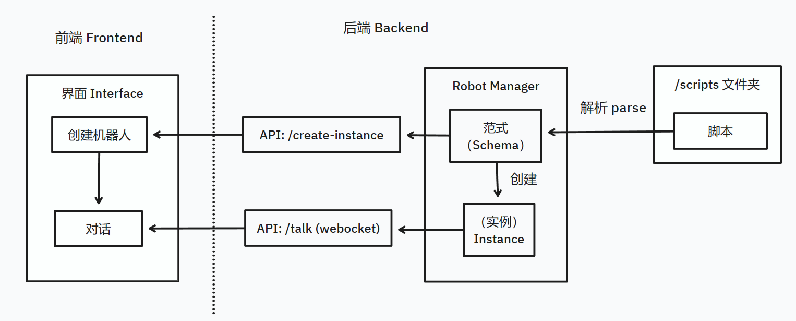

# 应答机器人的模块设计

## 总论

本程序使用 CS 架构，本质上是一个前后端项目。文件目录介绍如下：

```
.
├── README.md  # 仓库说明文件
├── docs  # 说明文档
├── log   # 后端日志
├── main.py  # 后端入口程序
├── module  # 应答机器人后端
├── requirements-in.txt  # Python 环境依赖
├── requirements.txt   # Python 环境依赖
├── scripts  # 应答机器人脚本文件夹
├── tests  # 测试文件夹
└── webapp  # 前端文件夹
```

## 整体架构与流程介绍



程序启动之后，后端程序会立刻从 /scripts 中读取所有脚本，解析成机器人范式（RobotSchema），然后开放 API 接口给前端调用。

前端用户的行为大致可以概括如下：

1. 通过列出所有的 Schema，选择合适的机器人并创建
2. 和机器人对话

上面两个步骤都通过与 API 接口交互完成

## 模块

对 `/module` 文件夹下内容的介绍。这里只作简单的功能介绍。因为每个模块负责的逻辑已经被分解得相当简单，多说无益。具体实现请查看代码。

### logger

日志系统。日志会输出到命令行中，同时也会保存到 /log 文件夹下，以日期分割。

### parse

YAML 的封装接口，负责将 .yaml 文件解析成一个字典，并捕获错误输入到日志。

### robot

对话机器人类。通过解析得到的字典创造机器人，同时捕获可能出现的错误。

通过检查解析得到的字典中是否存在特定名称的键，

### base

base 模块完成两个职责：

1. 维护所有的机器人范式与机器人实例
2. 维护所有 API 接口

API 接口的开放通过库 fastapi 完成；

本程序考虑到可能同时存在多个 WebSocket 连接，所以用 List 简单实现了一个多 Socket 管理系统，负责实时管理每个 Socket
的通信状态。详见类 `SocketManager`
`RobotManager` 维护所有实例和 Schema。

具体而言，所有对话机器人都由同一个 `class` 完成，通过将脚本解析得到的字典作为参数传入 `Chatbot` 的构造函数，从而构造出脚本规定的机器人。
Schema 本质上储存的是加载进运行时的，`scripts/` 目录下的脚本文件。前端调用 `/create-instance` 接口后，才创造出一个机器人实例。
储存机器人实例的容器数据结构为**字典 dict**，其中 key 是机器人的 hash 值，value 就是机器人实例对象本身。

# 系统中的数据结构设计

## 后端

### Chatbot

Chatbot 是一个属性深度嵌套的对象。其属性的具体含义可以参照 DSL 语法的说明文档。

### RobotManager

通过两个字典，分别储存 Schema 和 Instance

```python
class RobotManager:
    robot_schemas: dict[str, dict] = {}
    robot_instances: dict[str, Chatbot] = {}
```

字典的 key 都是 hash 值，用来唯一确认 value。其中 schema 使用的是对整个脚本文本做一次 sha1 计算。而 instance 使用的是
python 创建对象固有的 hash 值。

### SocketManager

一个内容不断变换的 Socket 列表，记录连接中的 Socket。

## 前端

前端使用 typescript 语言编写，这门语言难免需要对 Object 进行类型声明。在 `/webapp/src/api/types.ts` 中，对使用到的数据进行的类型与结构的定义。

```typescript
export type Robot = {
    bid: string
    name: string
    description: string
    opening: string
}

export type RobotInstance = {
    token: string
    bid: string
    name: string
    messages: Message[]
}

export type Message = {
    sender: UserType
    messageText: string
    messageTime: string
}
```

前端的数据类型面向 API 接口，所以命名方面与 API 文档中的命名相近。

- Robot 指代后端的 Schema
- RobotInstance 为机器人实例。由于前端需要显示处所有的历史记录，所以多了一个 Message 数组，用来储存用户与一个机器人实例的聊天记录。
- Message 为每个消息的数据结构，包含消息内容 messageText，消息时间 messageTime，和发送者 sender 三个属性。
