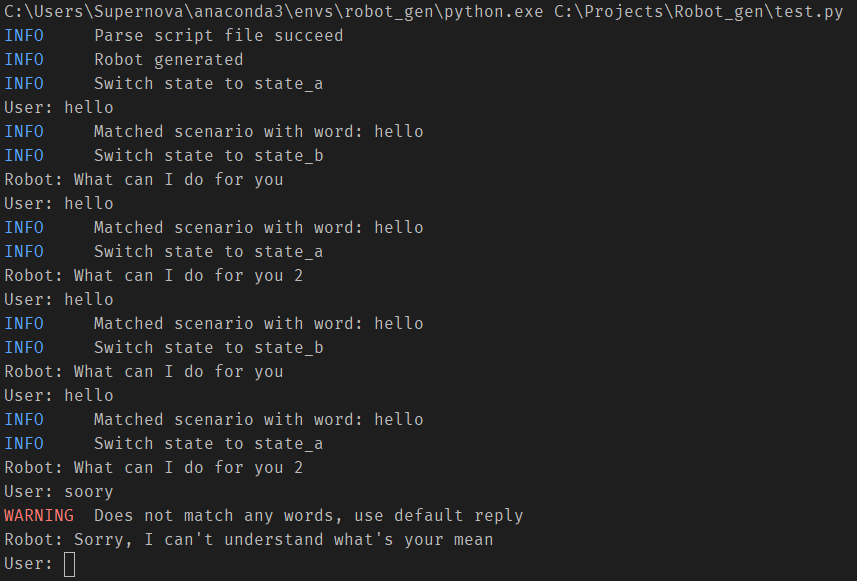

# 系统测试

程序的整体流程如下：

- 从文件系统中读入脚本，并解析成 schema
- 通过 schema 创建成机器人实例
- 向机器人实例输入文本，得到回复

所以我们的测试，也是围绕上面三个步骤展开。

## 脚本的读取与解析测试

通过调用 RobotManager 的 load_schema() 方法，将 scripts 文件夹下的所有脚本读取到内存，然后测试其是否与预期结果一致：

```python
def test_read():
    robot_manager = RobotManager()
    robot_manager.load_schemas()
    schema_names = [schema['name'] for schema in robot_manager.robot_schemas.values()]
    assert schema_names == ['助教机器人', '销售机器人', 'demo robot']
```

## 创建机器人实例测试 && 机器人应答测试

通过编写一个简单的机器人脚本，然后验证输入是否能得到预期的输出即可。

```yaml
name: test
description: 用户输入测试
initial: state_a
opening: opening statement
states:
  - name: state_a
    default: default reply
    scenarios:
      - triggers:
          - trigger1
          - trigger2
        action:
          reply:
            reply1
      - triggers:
          - trigger3
        action:
          reply:
            reply2
```

测试代码：

```python
def test_empty():
    assert list(test.take_input("")) == ['default reply']  # 空串不匹配任何值，触发默认回复


def test_correct():
    assert list(test.take_input("trigger1")) == ['reply1']  # 等于 trigger 的触发回复
    assert list(test.take_input("trigger2")) == ['reply1']


def test_duplicate_trigger():
    assert list(test.take_input("trigger1 trigger1")) == ['reply1']  # 同一个 trigger 只触发一次
    assert list(test.take_input("trigger1 trigger2")) == ['reply1']


def test_multiple_trigger():
    assert list(test.take_input("trigger1 trigger3")) == ['reply1', 'reply2']  # 多个 trigger 会多次触发
    assert list(test.take_input("trigger1 trigger2 trigger3")) == ['reply1', 'reply2']

```

## 综合测试

在 test.py 中，编写了一个命令行版的对话机器人。可以正常读入脚本，然后进行对话运行，测试到了整体流程，模拟真实的使用环境。



其中，Robot 为机器人回复，User 为用户输入，其他的高亮语句为 log 的输出。